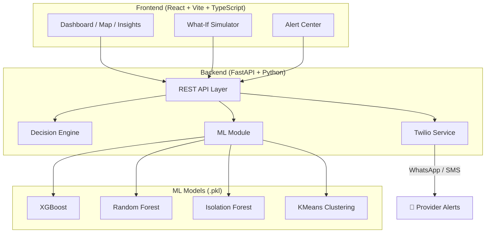

<p align="center">
  <h1 align="center">🏥 Provider Intelligence Engine</h1>
  <p align="center">
    <strong>AI-Powered Healthcare Provider Network Adequacy & Access-Gap Intelligence Platform</strong>
  </p>
  <p align="center">
    <strong>Live Demo: <a href="https://provider-intelligence-engine.vercel.app/" target="_blank">provider-intelligence-engine.vercel.app</a></strong>
  </p>
  <p align="center">
    <a href="#features">Features</a> •
    <a href="#architecture">Architecture</a> •
    <a href="#quick-start">Quick Start</a> •
    <a href="#api-endpoints">API</a> •
    <a href="#deployment">Deployment</a>
  </p>
</p>

---

## 🎯 Overview

**Provider Intelligence Engine** is a full-stack healthcare analytics platform that helps insurance payers and network managers identify **provider access gaps**, understand **why they exist**, and simulate **provider recruitment strategies** — all powered by machine learning.

The system combines:
- **ML Classification** (XGBoost, Random Forest, Decision Tree, Logistic Regression) to predict access-gap risk levels
- **Anomaly Detection** (Isolation Forest) to flag unusual supply/demand patterns
- **KMeans Clustering** to group geographic areas by healthcare characteristics
- **Geospatial Analysis** for provider-to-service-area distance calculations
- **Automated Alerts** via Twilio (WhatsApp + SMS) for critical shortages
- **Interactive Dashboard** with maps, charts, and what-if simulations

---

## ✨ Features

| Feature | Description |
|---------|-------------|
| 📊 **Network Dashboard** | KPIs, charts, and critical area overview at a glance |
| 🗺️ **Interactive Map** | Leaflet-powered map with risk markers, filters, and area popups |
| 🔍 **Area Insights** | Deep-dive analysis with root cause explanations and recommendations |
| 📋 **Recommendations** | Prioritized provider recruitment table with sorting/filtering |
| 🧪 **What-If Simulator** | Simulate adding providers to see projected impact |
| 🔔 **Alert Center** | Twilio-powered WhatsApp & SMS notifications for critical gaps |
| 🤖 **ML Predictions** | Multi-model ensemble for access-gap classification |
| 🧠 **Explainable AI** | XAI engine providing reasoning behind predictions |

---

## 🏗️ Architecture



---

## 🛠️ Tech Stack

| Layer | Technologies |
|-------|-------------|
| **Frontend** | React 19, TypeScript, Vite, Tailwind CSS, Leaflet, Recharts, Lucide |
| **Backend** | Python, FastAPI, Pydantic, Uvicorn |
| **ML/AI** | scikit-learn, XGBoost, pandas, joblib |
| **Notifications** | Twilio (WhatsApp + SMS) |
| **Deployment** | Docker, Render (backend), Vercel (frontend) |

---

## 📁 Project Structure

```
Provider-Intelligence-Engine/
├── README.md                    # You are here
├── .env.example                 # Environment variable template
├── .gitignore                   # Git ignore rules
├── render.yaml                  # Render deployment blueprint
│
├── backend/                     # FastAPI Python backend
│   ├── Dockerfile               # Container config
│   ├── requirements.txt         # Python dependencies
│   ├── app/
│   │   ├── main.py              # FastAPI entry point
│   │   ├── core/                # Config, security, database
│   │   ├── api/                 # Router + route handlers
│   │   ├── services/            # Business logic (ML, Twilio)
│   │   ├── decision_engine/     # Gap calc, risk, XAI engine
│   │   ├── ml/                  # ML modules + trained .pkl models
│   │   ├── schemas/             # Pydantic request/response DTOs
│   │   └── ...
│   └── tests/                   # Pytest test suite
│
├── frontend/                    # React + Vite + TypeScript
│   ├── vercel.json              # Vercel deployment config
│   ├── src/
│   │   ├── components/          # Reusable UI components
│   │   ├── pages/               # Route pages (Dashboard, Map, etc.)
│   │   ├── services/            # API service layer
│   │   ├── context/             # React contexts
│   │   └── types/               # TypeScript interfaces
│   └── ...
│
├── ml_training/                 # ML model training scripts
│   ├── train_classifiers.py     # Train access-gap classifiers
│   ├── train_anomaly.py         # Train anomaly detector
│   ├── run_clustering.py        # Run KMeans clustering
│   └── ...
│
└── data/                        # Datasets
    ├── raw/                     # Original source data
    ├── processed/               # Transformed outputs
    └── splits/                  # Train/test splits
```

---

## 🚀 Quick Start

### Prerequisites

- **Python 3.11+** and **pip**
- **Node.js 18+** and **npm**
- **Twilio account** (optional, for SMS/WhatsApp alerts)

### 1. Clone the Repository

```bash
git clone https://github.com/Ashmita984/Provider-Intelligence-Engine.git
cd Provider-Intelligence-Engine
```

### 2. Backend Setup

```bash
# Install Python dependencies
pip install -r backend/requirements.txt

# Configure environment
cp .env.example .env
# Edit .env with your Twilio credentials (optional)

# Start the API server
cd backend
uvicorn app.main:app --reload --host 0.0.0.0 --port 8000
```

API docs available at: **http://localhost:8000/docs**

### 3. Frontend Setup

```bash
# Install Node dependencies
cd frontend
npm install

# Start the dev server
npm run dev
```

App available at: **http://localhost:5173**

---

## 📡 API Endpoints

| Method | Endpoint | Description |
|--------|----------|-------------|
| `GET` | `/` | Health check |
| `POST` | `/api/ml/predict` | ML access-gap, cluster, & anomaly prediction |
| `POST` | `/api/notification/notify` | Send WhatsApp alert (SMS fallback) |
| `POST` | `/api/notification/notify-sms` | Direct SMS alert |
| `GET` | `/api/dashboard` | Dashboard summary data |
| `GET` | `/api/data/areas` | Service area data |
| `GET` | `/api/analysis/insights` | Analytics insights |
| `POST` | `/api/simulation/what-if` | What-if simulation |

Full interactive docs at `/docs` (Swagger UI) when running the backend.

---

## 🌐 Deployment

### Backend → Render

1. Push this repo to GitHub
2. Go to [render.com](https://render.com) → **New** → **Blueprint**
3. Connect your GitHub repo — Render auto-detects `render.yaml`
4. Add environment variables (Twilio credentials) in the Render dashboard
5. Deploy!

### Frontend → Vercel

The frontend is live at: [provider-intelligence-engine.vercel.app](https://provider-intelligence-engine.vercel.app/)

To redeploy or set up your own:
1. Go to [vercel.com](https://vercel.com) → **New Project**
2. Import `Ashmita984/Provider-Intelligence-Engine`
3. Set **Root Directory** to `frontend`
4. Vercel auto-detects Vite — click **Deploy**
5. Update the API URL in `frontend/vercel.json` with your Render backend URL

---

## 🧪 Running Tests

```bash
# Backend tests
cd backend
python -m pytest tests/ -v

# Frontend lint
cd frontend
npm run lint
```

---

## 📝 Environment Variables

| Variable | Description | Required |
|----------|-------------|----------|
| `TWILIO_ACCOUNT_SID` | Twilio Account SID | For alerts |
| `TWILIO_AUTH_TOKEN` | Twilio Auth Token | For alerts |
| `TWILIO_WHATSAPP_NUMBER` | Twilio WhatsApp number | For WhatsApp |
| `TWILIO_SMS_FROM` | Twilio SMS sender number | For SMS |
| `VITE_API_BASE_URL` | Backend API URL (frontend) | Optional |

---

## 👥 Contributors

- **Ashmita** — Full-Stack Development & ML Engineering

---

## 📄 License

This project is for educational and demonstration purposes.
